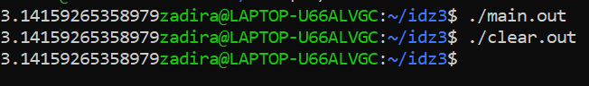
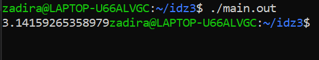
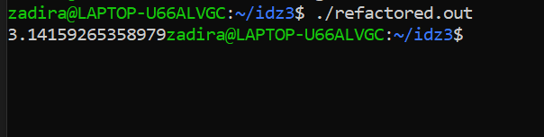

# Отчет ИДЗ 3

## Парахин Николай Викторович

## БПИ 212

&nbsp;

### Вариант 21

__Условие:__
 Разработать программу вычисления числа π с точностью не хуже 0,05% посредством ряда Нилаканта.

## На 4 балла

Мною была написана программа на С:

### main.c

``` C
#include <stdio.h>

double get_pi(double pi) {
    for (double i = 2.0; i < 3000000; i += 4) {
        pi += 4.0 / (i * (i + 1) * (i + 2));
        pi -= 4.0 / ((i + 2) * (i + 3) * (i + 4));
    }
    return pi;
}


int main(int argc, char *argv[]) {
    double pi = 3.0;
    printf("%.14f", get_pi(pi));
    return 0;
}
```

1) Использовал команду __gcc -S -O0 main.c__, чтобы создать ассемблерыный файл main.s без оптимизирующих и отладочных операций.
Чтобы не было этих операций, использовал в строке ключ -O0.
2) Использовал команду __gcc -O0 -Wall -masm=intel -S -fno-asynchronous-unwind-tables -fcf-protection=none main.c -o clear.s__, чтобы модифицировать программу, убрать макросы.
3) Использовал команды __gcc -O0 main.s -o main.out__ и __gcc -O0 clear.s -o clear.out__, чтобы создать исполняемые файлы __main.out__ и __clear.out__ c флагом -O0.
4) Результаты тестов:

__Вывод:__ Программы дают одинаковый результат на данных тестах.
Список модификаций: Использовав команду с __-Wall -masm=intel -S -fno-asynchronous-unwind-tables -fcf-protection=none__ ушли макросы .cfi, которые служили для отладночной информации.
Я использовал команду __cat main.s | awk '/^\t./ { print \$ 1 }' | sort | uniq > main_macros.txt__ и __cat clear_main.s | awk '/^\t./ { print \$ 1 }' | sort | uniq > clear_main_macros.txt__, чтобы понять, какие макросы ушли.

__Дополнение:__
Мною были проведены еще ряд махинаций с программой через ключи.
Если использовать команду __gcc -O2 -flto -Wall -masm=intel -S -fno-asynchronous-unwind-tables -fcf-protection=none main.c -o giga_clear_main.s__ то можно избавиться от большинства макросов (__gcc -O2 -flto -Wall -masm=intel -S -fno-asynchronous-unwind-tables -fcf-protection=none main.c -o giga_clear_main.s__).

Описание переменных смотри в main.s в директории for4.

## На 5 баллов

P.S. Программа на 4 и на 5 одинаковы, т.к. я решил сразу писать программу с отдельным методом.

1) Написал программу с функцией get_pi, которая принимает в параметры поинтер на массив с char-ами.

```C
#include <stdio.h>

// функция
double get_pi(double pi) {
    for (double i = 2.0; i < 3000000; i += 4) {
        pi += 4.0 / (i * (i + 1) * (i + 2));
        pi -= 4.0 / ((i + 2) * (i + 3) * (i + 4));
    }
    return pi;
}


int main(int argc, char *argv[]) {
    double pi = 3.0;
    printf("%.14f", get_pi(pi));
    return 0;
}
```

2) Использовал локальные переменные в функции main и в функции get_pi, в которую через параметр можно передать pi.

3) Использовал команду __gcc -O0 -Wall -masm=intel -S -fno-asynchronous-unwind-tables -fcf-protection=none main_param.c -o main_param.s__ чтобы получить ассемблерный код (смотри директорию for5).

4) Провел тестирования:

Видно, что работа программы аналогична работе предыдущих.

5) В файле main_param.s есть описание всех нужных параметров функций и связи их с регистрами.

## На 6 баллов

Мною был модифицирован код. Использовал регистр r12d.

Название файла - refactored_main.s

DWORD PTR -20[rbp] -> r12d

Видно, что программа работает на тестах валидно:


Кол-во строк в файле 137
Кол-во строк в main.s (аналог clear_main.s, но с комментариями): 171

# Спасибо!
